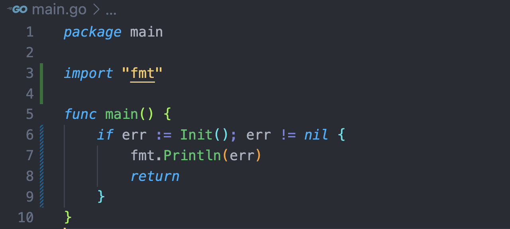
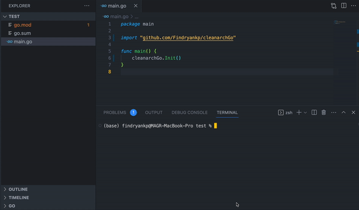
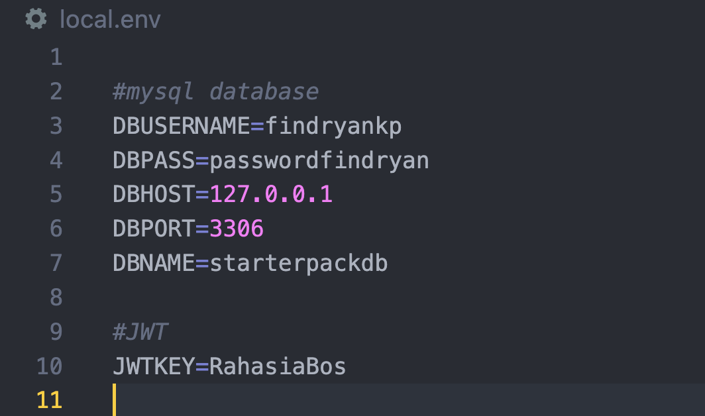
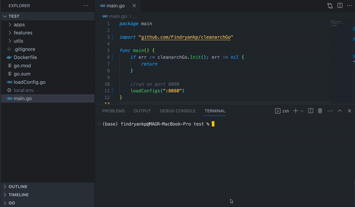

# cleanarchGo
<div align="center">
  <a href="images/logo.png">
    
  </a>
</div>

## 💫 About
Clean architecture starter pack for faster and easier feature creation using Go.
* This pack includes Clean Architecture with the Echo framework, Gorm, Viper (env), Govalidator, Jwt, and more. 
* You can create CRUD features in less than one minute
* `.gitignore` , `Dockerfile` will also be generated too.
* Auth feature and users feature will also generated :
<details>
<summary>🔗 Auth Routes</summary>
  
| Method      | Endpoint            | Params      | JWT Token   | Function                                |
| ----------- | ------------------- | ----------- | ----------- | --------------------------------------- |
| POST        | /login            | -    | NO          | Login User  |
| POST        | /register         | -    | NO          | Register User  |
| POST        | /change-password  | -    | YES         | Change Password |
| GET         | /claim-token      | -    | YES         | Get Token Data |
</details>

<details>
<summary>🔗 Users Routes</summary>
  
| Method      | Endpoint            | Params      | JWT Token   | Function                                |
| ----------- | ------------------- | ----------- | ----------- | --------------------------------------- |
| GET         | /users   | -     | NO          | Get All Users  |
| GET         | /users   | id    | NO          | Get User By Id |
| PUT         | /users   | id    | NO          | Edit User |
| DELETE       | /users  | id    | NO          | Delete user |
</details>

## 🚀 Import
```shell
go get -u github.com/Findryankp/cleanarchGo@latest
```

## 👨🏽‍💻 Step By Step
1. First step, add this syntax to your `main function` in file `main.go`
```go
cleanarchGo.Init();
```
* for example :
<div align="center">
  <a href="images/01.png">
    
  </a>
</div>

2. Run this syntax in cmd/ terminal
```shell
go run . init
```
<div align="center">
  <a href="images/init.png">
    
  </a>
</div>

* If success, the files that will be generated are :
- [x] configs database
- [x] middlewares (jwt auth, logs, cors)
- [x] environment (local.env)
- [x] etc

3. Set `local.env` with your own configuration database
<div align="center">
  <a href="images/04.png">
    
  </a>
</div>

## 🚀 Create new feature
* run this syntax in your cmd/terminal
```shell
go run . features featuresNames
```
* ex : `go run . features rooms`

* CRUD Features, Code all layer, route, and migratiton feature from your featureNames will be created
  
<details>
<summary>🔗 featureNames Routes</summary>
  
| Method      | Endpoint            | Params      | JWT Token   | Function                                |
| ----------- | ------------------- | ----------- | ----------- | --------------------------------------- |
| POST        | /featureNames              | -           | NO          | Post a featureNames as a host                    |
| GET         | /featureNames   | -    | NO          | Get All Available your featureNames  |
| GET         | /featureNames   | id    | NO          | Get featureNames Detail |
| PUT         | /featureNames   | id    | NO          | Edit featureNames |
| DELETE       | /featureNames   | id    | NO          | Delete featureNames |
</details>

<div align="center">
  <a href="images/feature.png">
    
  </a>
</div>

## 🎯 Run Project
```shell
go run .
```

* try with your postman or another
<div align="center">
  <a href="images/05.png">
    
  </a>
</div>

## 😎 Development by
[](https://github.com/Findryankp)
[](https://www.linkedin.com/in/Findryankp/)
